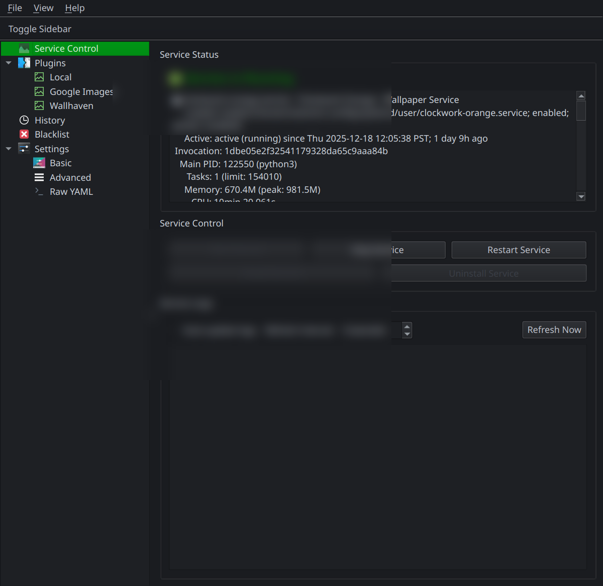
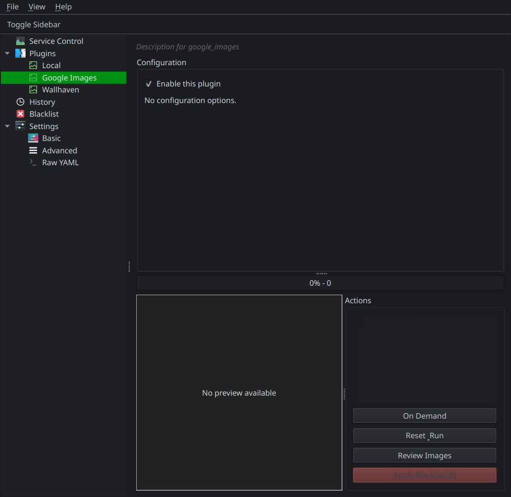
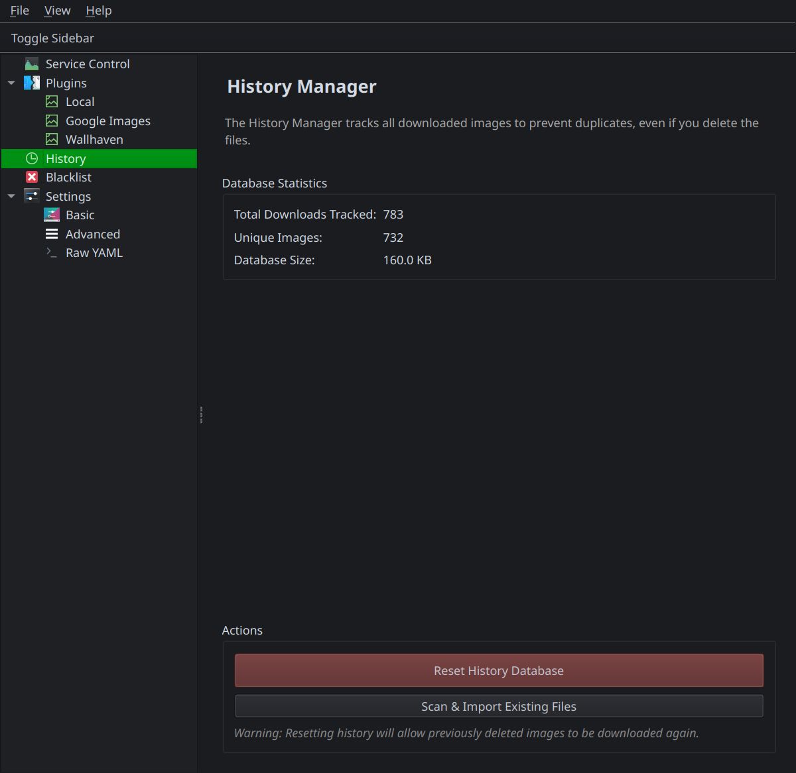
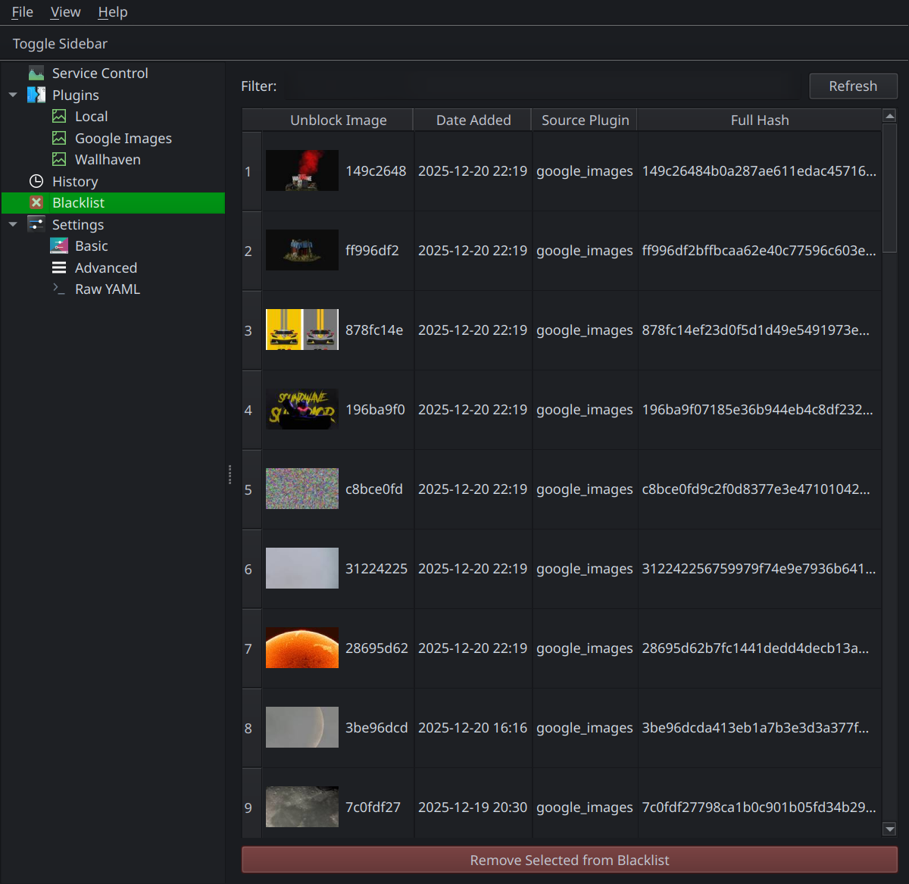
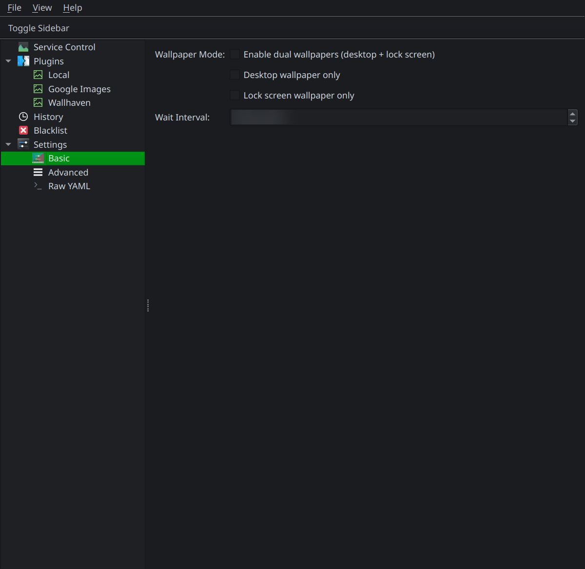

# Clockwork Orange GUI Documentation

This document provides a tour of the user interface. Sensitive text areas in the screenshots have been automatically redacted.
## Service Control
The main dashboard for managing the background daemon. You can start/stop the service and view recent logs.

## Plugin Configuration
Configure individual plugins. Features include search terms, enablement toggles, and on-demand execution controls.

## Wallpaper History
View a log of previously set wallpapers. Includes stats on plugin usage.

## Blacklist Manager
Review and manage blacklisted images. Blacklisted images will definitely be excluded from rotation.

## Basic Settings
Configure general application behavior like theme and startup options.

