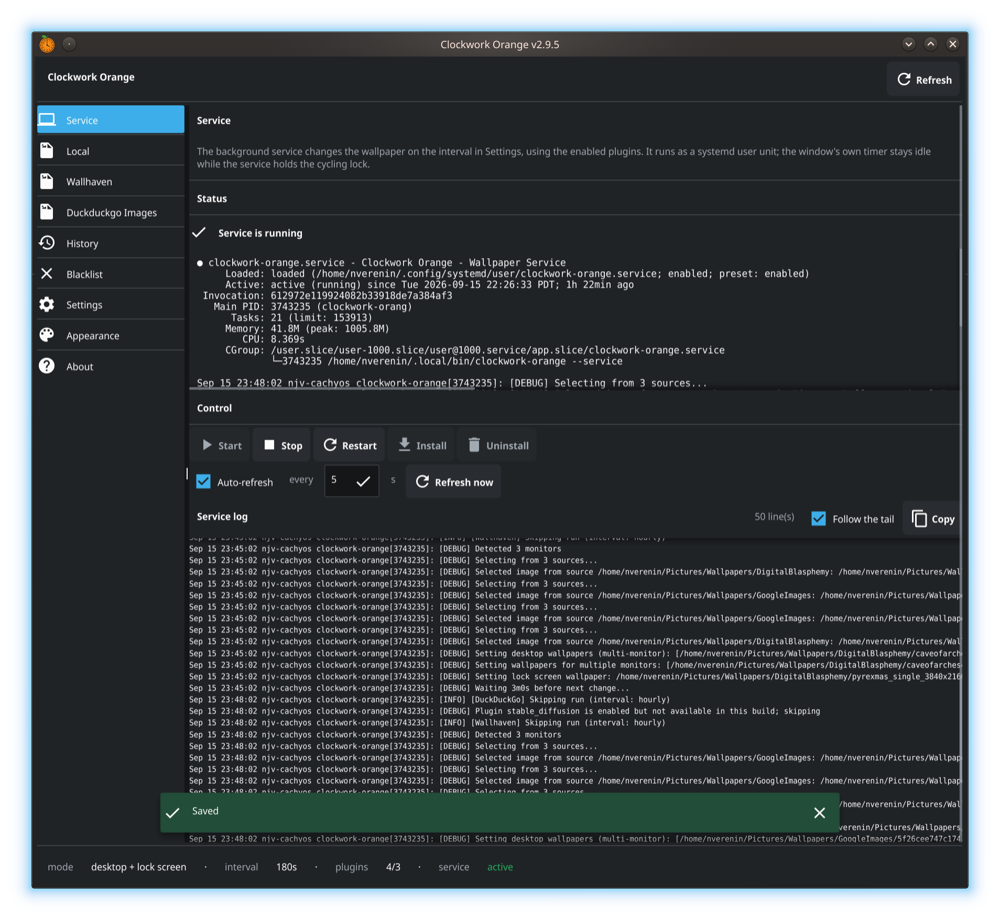
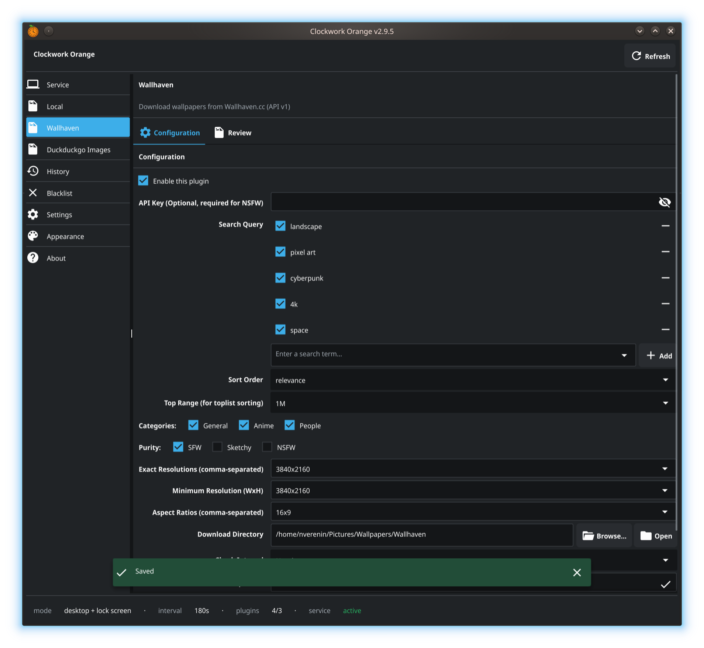
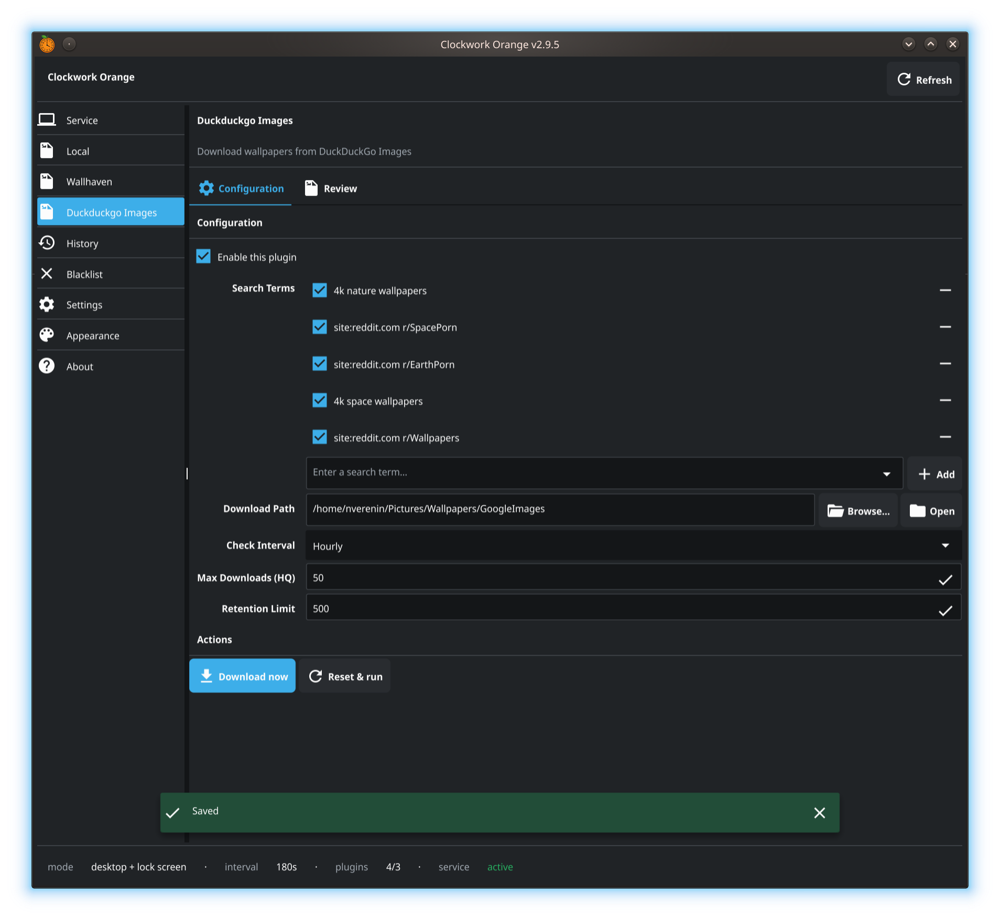
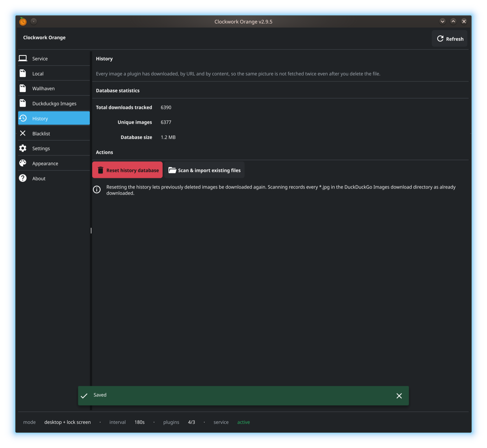
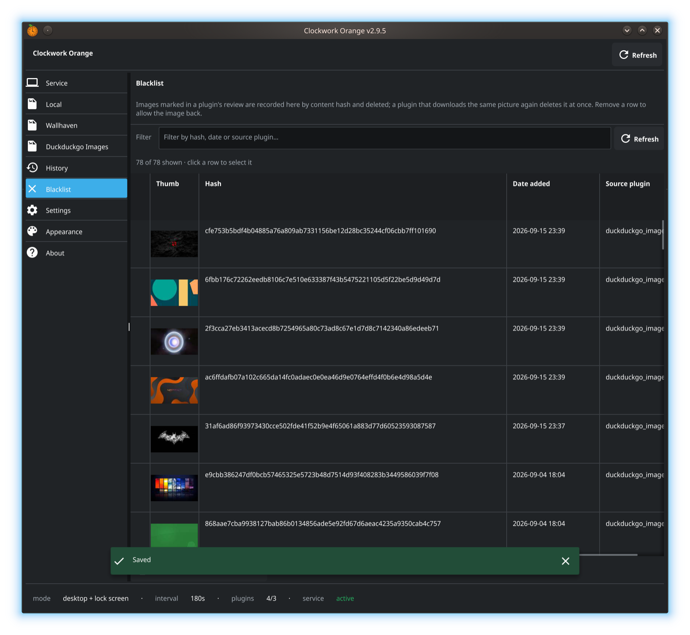
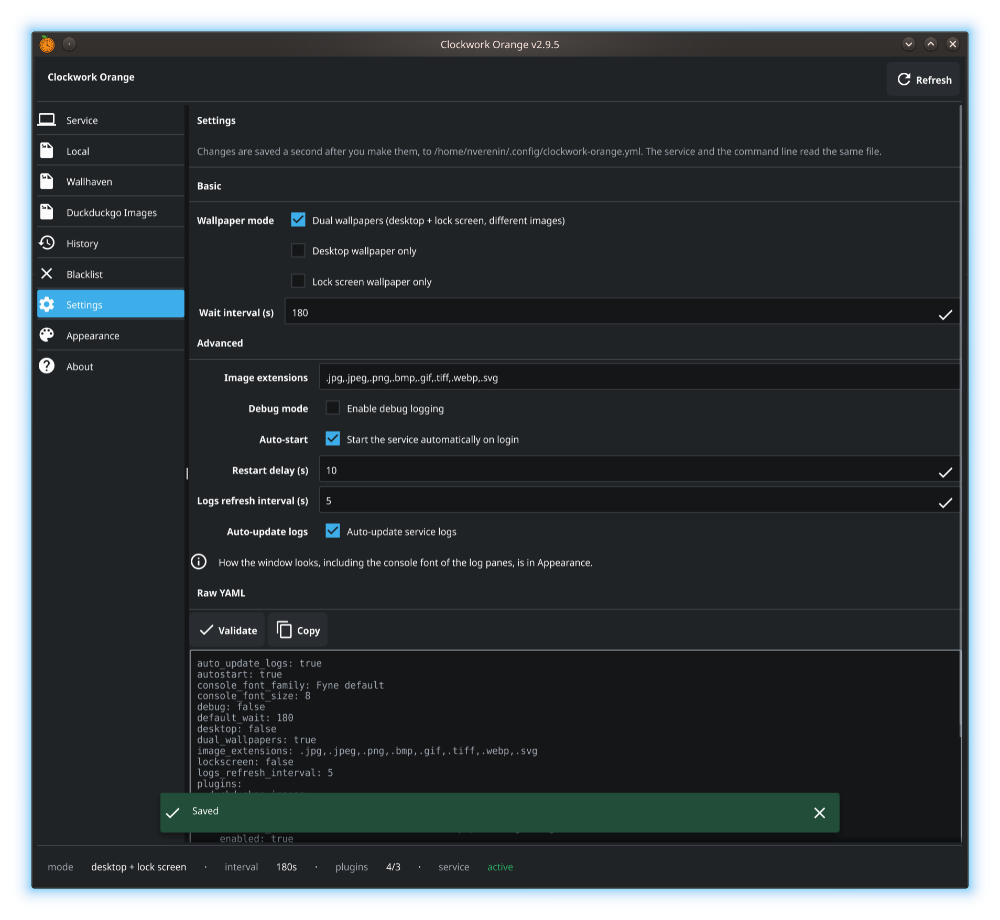
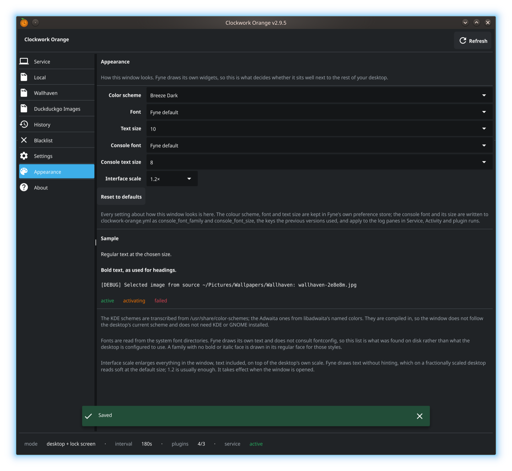
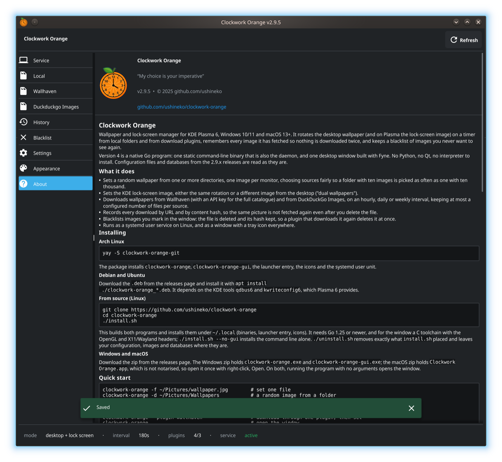

# Clockwork Orange: the window

A tour of `clockwork-orange-gui`. Every action here is also a subcommand of
`clockwork-orange`; the window renders the same operations, so the two cannot
disagree about what they do. Screenshots are from KDE Plasma 6 with the Breeze
Dark scheme.

## Service (Linux)

The systemd user unit: whether it is running, `systemctl status`, Start / Stop /
Restart / Install / Uninstall, and the journal tail with an auto-refresh
toggle. The status bar at the bottom says whether the window's own timer is
idle because the service holds the cycling lock. On Windows and macOS this
section is **Activity**, the log of what the window's timer has done.

## Plugins

One section per plugin, each with two tabs. **Configuration** is generated
from the plugin's settings: an enable switch, then every field with the right
editor (a list of search terms with per-term check boxes, a dropdown for an
enumeration, a browse button for a directory). Changes are saved a second
after you make them. **Download now** runs the plugin in a progress window
with its log and a preview of each image as it lands; **Reset & run** empties
the download folder first.

The **Review** tab shows the plugin's folder newest first. Arrow keys move,
Space marks an image with a red border and cross, and **Apply blacklist**
deletes the marked images and records their hashes so no plugin downloads
them again. The folder is watched, so a run that lands new images re-scans it.

## History

How many downloads and unique images are recorded. **Reset history database**
forgets them (plugins may download previously seen images again);
**Scan & import existing files** records images already on disk.

## Blacklist

Every blocked image with its thumbnail, hash, date and the plugin that
blocked it. Filter as you type; click rows to select them; **Remove selected
from blacklist** lets an image back in.

## Settings

Wallpaper mode (dual, desktop only, lock screen only), the wait interval,
image extensions, debug logging and, on Linux, the service's auto-start,
restart delay and log refresh. A read-only view of the YAML file is at the
bottom with Validate and Copy.

## Appearance

Colour scheme (Breeze Dark and Light, Oxygen Dark, Adwaita Dark and Light),
interface font and text size, the console font used by the log panes, and an
interface scale for high-DPI desktops where Fyne's unhinted text reads soft
at 1×.

## About

Version, project link and the README.

## Tray

Closing the window hides it to the tray; the timer keeps changing wallpapers.
The tray menu has Show, About and Quit. Launching the program again while it
is in the tray brings the window back.
