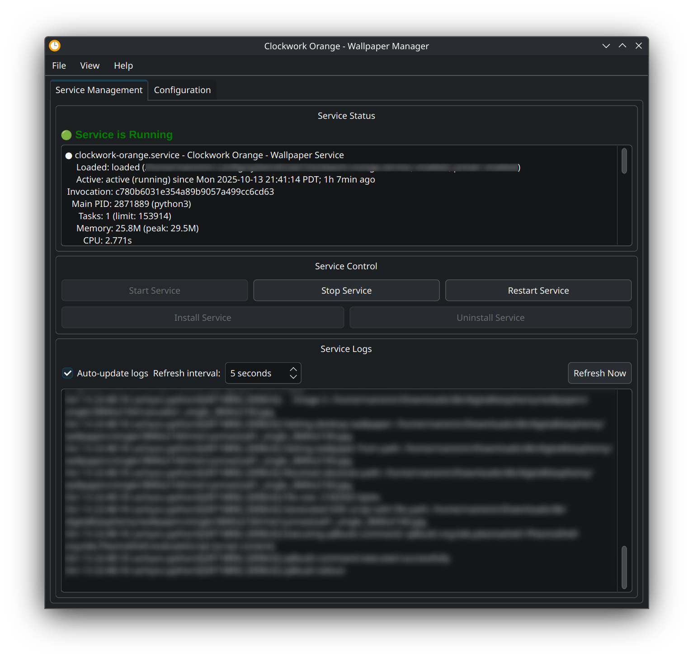

# clockwork-orange

A Python script for managing wallpapers and lock screen backgrounds on **KDE Plasma 6 only**. The script supports setting wallpapers from URLs, local files, or random selection from directories, with options for both desktop and lock screen backgrounds.

> **⚠️ IMPORTANT:** This script is designed specifically for KDE Plasma 6 and requires `qdbus6` and `kwriteconfig6` commands. It will not work with older KDE versions.

*Clockwork Orange: Our Choice Is Your Imperative (tm)*

## Table of Contents

- [Features](#features)
- [Requirements](#requirements)
- [Installation](#installation)
- [Quick Start](#quick-start)
  - [Basic Usage](#basic-usage)
  - [Configuration File](#configuration-file)
- [Command Line Options](#command-line-options)
- [Configuration File](#configuration-file-1)
  - [Configuration Options](#configuration-options)
- [How It Works](#how-it-works)
  - [Desktop Wallpapers](#desktop-wallpapers)
  - [Lock Screen Wallpapers](#lock-screen-wallpapers)
  - [Image Detection](#image-detection)
- [Graphical User Interface](#graphical-user-interface)
  - [Starting the GUI](#starting-the-gui)
  - [GUI Features](#gui-features)
  - [GUI Requirements](#gui-requirements)
  - [Desktop Entry Installation](#desktop-entry-installation)
- [Running as a Background Service](#running-as-a-background-service)
  - [Option 1: Systemd User Service (Recommended)](#option-1-systemd-user-service-recommended)
  - [Option 2: Simple Background Process](#option-2-simple-background-process)
  - [Option 3: Desktop Autostart](#option-3-desktop-autostart)
- [Service Files](#service-files)
  - [Service Configuration Notes](#service-configuration-notes)
- [Troubleshooting](#troubleshooting)
- [Examples](#examples)
- [Notes](#notes)
- [License](#license)

## Features

- **Multiple Sources**: Download from URLs, use local files, or randomly select from directories
- **Dual Wallpaper Support**: Set different wallpapers for desktop and lock screen simultaneously
- **Continuous Cycling**: Automatically cycle through wallpapers at specified intervals
- **Lock Screen Support**: Configure KDE Plasma 6 lock screen backgrounds
- **Configuration File**: YAML-based configuration for persistent settings
- **Service Mode**: Run as a background service with systemd
- **Detailed Debugging**: Detailed logging for troubleshooting

## Requirements

- **KDE Plasma 6** (REQUIRED - script will not work with older KDE versions)
- **Python 3.6+**
- **PyYAML** (`pip install PyYAML`)
- **qdbus6** (usually included with KDE Plasma 6)
- **kwriteconfig6** (usually included with KDE Plasma 6)
- **PyQt6** (optional, for GUI: `pip install PyQt6`)

## Installation

1. **Clone or download the script:**
   ```bash
   git clone https://github.com/ushineko/clockwork-orange
   cd clockwork-orange
   ```

2. **Install dependencies:**
   ```bash
   pip install PyYAML
   
   # Optional: Install GUI dependencies
   pip install PyQt6
   ```


3. **Make the script executable:**
   ```bash
   chmod +x clockwork-orange.py
   ```

## Arch Linux Installation

### From AUR (Recommended)
This package is designed for the AUR. Once submitted, you can install it using your favorite AUR helper:
```bash
yay -S clockwork-orange-git
```

### Local Development / Manual Build
To build the package from your local repository (useful for testing changes before pushing):
```bash
./build_local.sh
sudo pacman -U clockwork-orange-git-*.pkg.tar.zst
```

## Quick Start

### Basic Usage

```bash
# Set desktop wallpaper from URL (default behavior)
./clockwork-orange.py

# Set desktop wallpaper from local file
./clockwork-orange.py -f /path/to/image.jpg

# Set random desktop wallpaper from directory
./clockwork-orange.py -d /path/to/wallpapers

# Set lock screen wallpaper
./clockwork-orange.py --lockscreen -f /path/to/image.jpg

# Set different wallpapers for desktop and lock screen
./clockwork-orange.py --desktop --lockscreen -d /path/to/wallpapers

# Cycle through random wallpapers every 5 minutes
./clockwork-orange.py -d /path/to/wallpapers -w 300

# Start the graphical user interface
./clockwork-orange.py --gui
```

### Configuration File

Create a configuration file for persistent settings:

```bash
# Create initial configuration
./clockwork-orange.py --desktop --lockscreen -d /path/to/your/wallpapers -w 300 --write-config

# Now you can just run without arguments
./clockwork-orange.py
```

## Command Line Options

### Target Selection
- `--desktop` - Set desktop wallpaper only
- `--lockscreen` - Set lock screen wallpaper only
- `--desktop --lockscreen` - Set both (different images)

### Source Options (mutually exclusive)
- `-u, --url URL` - Download from URL
- `-f, --file PATH` - Use local file
- `-d, --directory PATH` - Random selection from directory

### Other Options
- `-w, --wait SECONDS` - Wait interval for cycling (directory mode only)
- `--write-config` - Write configuration file and exit
- `--debug-lockscreen` - Show current lock screen configuration
- `--gui` - Start the graphical user interface

## Configuration File

The script supports a YAML configuration file at `~/.config/clockwork-orange.yml`:

```yaml
# Enable dual wallpaper mode (both desktop and lock screen with different images)
dual_wallpapers: true

# Default directory for wallpapers
default_directory: /path/to/your/wallpapers

# Default wait interval for cycling (in seconds)
default_wait: 300

# Alternative: Enable only desktop mode
# desktop: true

# Alternative: Enable only lock screen mode  
# lockscreen: true

# Alternative: Set default URL
# default_url: "https://pic.re/image"

# Alternative: Set default file
# default_file: "/path/to/specific/wallpaper.jpg"
```

### Configuration Options

- `dual_wallpapers: true` - Enable dual wallpaper mode
- `desktop: true` - Enable desktop wallpaper mode only
- `lockscreen: true` - Enable lock screen mode only
- `default_directory: "/path/to/wallpapers"` - Default wallpaper directory
- `default_file: "/path/to/wallpaper.jpg"` - Default wallpaper file
- `default_url: "https://example.com/image.jpg"` - Default URL
- `default_wait: 300` - Default wait interval for cycling

## How It Works

### Desktop Wallpapers
The script uses `qdbus6` to communicate with KDE Plasma's D-Bus interface:
```javascript
desktops().forEach(d => {
    d.currentConfigGroup = Array("Wallpaper", "org.kde.image", "General");
    d.writeConfig("Image", "file://FILEPATH");
    d.reloadConfig();
});
```

### Lock Screen Wallpapers
The script modifies the `~/.config/kscreenlockerrc` configuration file using `kwriteconfig6`:
```bash
kwriteconfig6 --file kscreenlockerrc \
  --group Greeter \
  --group Wallpaper \
  --group org.kde.image \
  --group General \
  --key Image "file:///path/to/image.jpg"
```

### Image Detection
The script automatically detects image files by:
- File extension (`.jpg`, `.jpeg`, `.png`, `.bmp`, `.gif`, `.tiff`, `.webp`, `.svg`)
- MIME type detection as fallback

## Graphical User Interface

The script includes a modern Qt-based GUI for easy management of wallpapers and service configuration.



### Starting the GUI

```bash
./clockwork-orange.py --gui
```

### GUI Features

- **Service Management Tab:**
  - View service status (running/stopped/failed)
  - Start, stop, and restart the service
  - Install/uninstall the systemd service
  - View real-time service logs
  - Auto-refresh status every 5 seconds

- **Configuration Tab:**
  - Basic settings: wallpaper modes, default paths, wait intervals
  - Advanced settings: image extensions, debug mode, auto-start
  - Raw YAML editor with validation and formatting
  - Load/save configuration files
  - Reset to defaults

- **System Tray Integration:**
  - Minimize to system tray
  - Status notifications
  - Quick access menu

- **Menu Bar:**
  - File menu with exit option
  - View menu with refresh functionality
  - Help menu with About dialog and Qt information
  - Keyboard shortcuts (Ctrl+Q, F5)

### GUI Requirements

- PyQt6 (`pip install PyQt6`)
- System tray support (most desktop environments)

### Desktop Entry Installation

To make Clockwork Orange appear in your application launcher and allow pinning to the taskbar:

```bash
# Install desktop entry
./install-desktop-entry.sh

# Or manually install
cp clockwork-orange.desktop ~/.local/share/applications/
update-desktop-database ~/.local/share/applications/
```

After installation, you can:
- Find "Clockwork Orange" in your application launcher
- Right-click the application to pin it to your taskbar
- Use the application like any other desktop application

## Running as a Background Service

### Option 1: Systemd User Service (Recommended)

1. **Setup the service:**
   ```bash
   mkdir -p ~/.config/systemd/user
   cp clockwork-orange.service ~/.config/systemd/user/
   systemctl --user daemon-reload
   systemctl --user enable clockwork-orange.service
   ```

2. **Start the service:**
   ```bash
   systemctl --user start clockwork-orange.service
   ```

3. **Management commands:**
   ```bash
   # Check status
   systemctl --user status clockwork-orange.service
   
   # View logs
   journalctl --user -u clockwork-orange.service -f
   
   # Stop service
   systemctl --user stop clockwork-orange.service
   
   # Restart service
   systemctl --user restart clockwork-orange.service
   ```

### Option 2: Simple Background Process

```bash
# Run in background with nohup
nohup ./run_clockwork_orange.sh --desktop --lockscreen -d /path/to/wallpapers -w 300 > clockwork-orange.log 2>&1 &

# Or run with screen/tmux for better process management
screen -S clockwork-orange ./run_clockwork_orange.sh --desktop --lockscreen -d /path/to/wallpapers -w 300
```

### Option 3: Desktop Autostart

Create `~/.config/autostart/clockwork-orange.desktop`:
```ini
[Desktop Entry]
Type=Application
Name=Clockwork Orange
Comment=Automatic wallpaper cycling service
Exec=/path/to/your/clockwork-orange/run_clockwork_orange.sh --desktop --lockscreen -d /path/to/wallpapers -w 300
Hidden=false
NoDisplay=false
X-GNOME-Autostart-enabled=true
```

## Service Files

The repository includes several service-related files:

- `clockwork-orange.service` - Systemd user service file
- `run_clockwork_orange.sh` - Wrapper script with proper environment setup
- `clockwork-orange.yml.example` - Example configuration file

### Service Configuration Notes

The service file uses `/usr/bin/python3` by default. If you're using a conda environment, virtual environment, or custom Python installation, you may need to update the `ExecStart` path in the service file to point to your specific Python interpreter.

**For conda/virtual environments:**
```ini
ExecStart=/path/to/your/python /path/to/clockwork-orange/clockwork-orange.py
```

**For system Python (default):**
```ini
ExecStart=/usr/bin/python3 /path/to/clockwork-orange/clockwork-orange.py
```

Make sure PyYAML is installed for your chosen Python interpreter:
```bash
# For system Python
sudo pacman -S python-yaml  # Arch Linux
sudo apt install python3-yaml  # Ubuntu/Debian

# For conda/virtual environments
pip install PyYAML
```

## Troubleshooting

### Check Service Status
```bash
systemctl --user status clockwork-orange.service
```

### View Service Logs
```bash
journalctl --user -u clockwork-orange.service -f
```

### Test Manually
```bash
# Test with your specific Python interpreter
/path/to/your/python clockwork-orange.py --desktop --lockscreen -d /path/to/wallpapers -w 30
```

### Check Environment Variables
```bash
echo $DISPLAY
echo $XDG_RUNTIME_DIR
echo $DBUS_SESSION_BUS_ADDRESS
```

### Debug Lock Screen Configuration
```bash
./clockwork-orange.py --debug-lockscreen
```

## Examples

### Daily Wallpaper Cycling
```bash
# Set up configuration for daily cycling
./clockwork-orange.py --desktop --lockscreen -d /home/user/Pictures/Wallpapers -w 86400 --write-config

# Run as service
systemctl --user start clockwork-orange.service
```

### Hourly Desktop Wallpaper Changes
```bash
# Desktop only, every hour
./clockwork-orange.py -d /home/user/DesktopWallpapers -w 3600
```

### Lock Screen Only
```bash
# Set lock screen from specific file
./clockwork-orange.py --lockscreen -f /home/user/lockscreen.jpg
```

## Notes

- The service automatically restarts if it crashes
- Make sure your wallpaper directory exists and contains image files
- The service runs with a 10-second restart delay if it fails
- Logs are available through journalctl for systemd services
- Command line arguments override configuration file settings
- The script ensures different images for desktop and lock screen in dual mode

## License

This project is licensed under the MIT License - see the [LICENSE](LICENSE) file for details.
