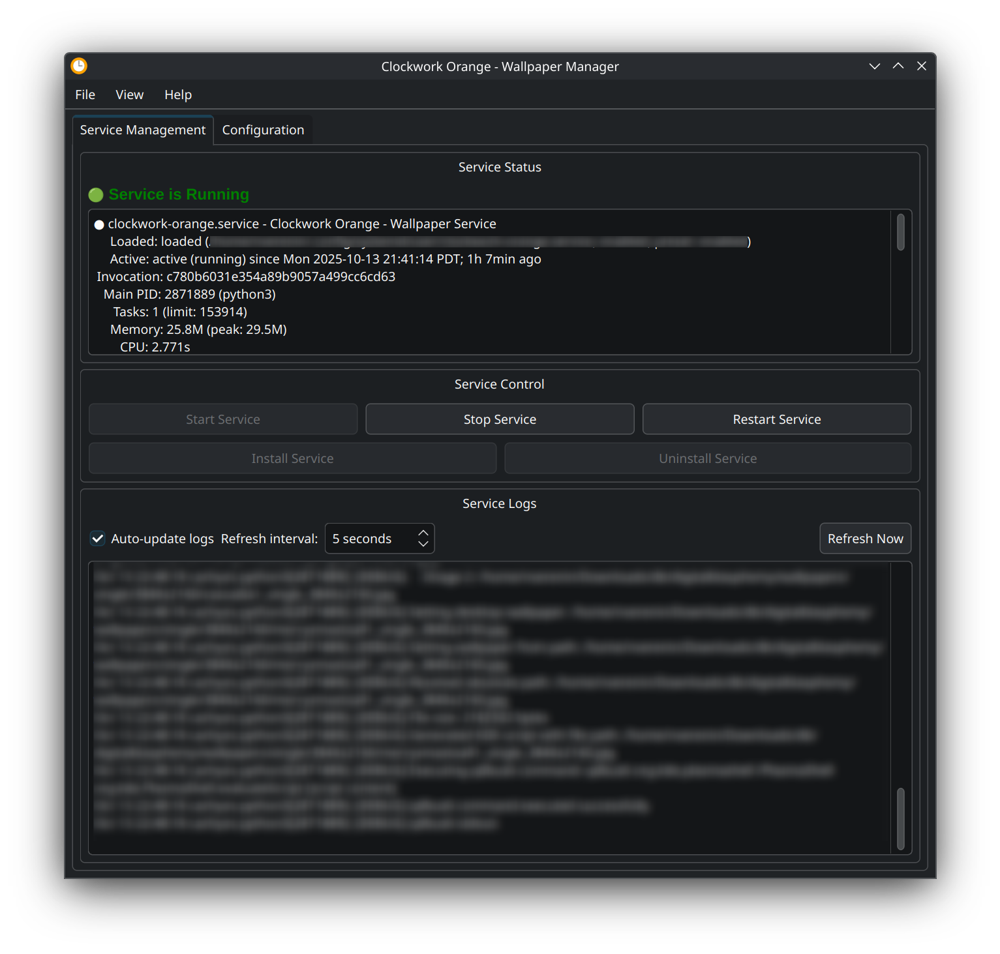

# Clockwork Orange

Wallpaper and lock-screen manager for KDE Plasma 6, Windows 10/11 and macOS 13+.
It rotates the desktop wallpaper (and on Plasma the lock-screen image) on a
timer from local folders and from download plugins, remembers every image it
has fetched so nothing is downloaded twice, and keeps a blacklist of images
you never want to see again.

Version 4 is a native Go program: one static command-line binary that is also
the daemon, and one desktop window built with Fyne. No Python, no Qt, no
interpreter to install. Configuration files and databases from the 2.9.x
releases are read as they are.

[GUI.md](GUI.md) is a tour of the window with screenshots;
[WALKTHROUGH.md](WALKTHROUGH.md) covers Windows and macOS.

## What it does

- Sets a random wallpaper from one or more directories, one image per monitor,
  choosing sources fairly so a folder with ten images is picked as often as one
  with ten thousand.
- Sets the KDE lock-screen image, either the same rotation or a different image
  from the desktop ("dual wallpapers").
- Downloads wallpapers from Wallhaven (with an API key for the full catalogue)
  and from DuckDuckGo Images, on an hourly, daily or weekly interval, keeping
  at most a configured number of files per source.
- Records every download by URL and by content hash, so the same picture is
  not fetched again even after you delete the file.
- Blacklists images you mark in the window: the file is deleted and its hash
  kept, so a plugin that downloads it again deletes it at once.
- Runs as a systemd user service on Linux, and as a window with a tray icon
  everywhere.

## Installing

### Arch Linux

    yay -S clockwork-orange-git

The package installs `clockwork-orange`, `clockwork-orange-gui`, the launcher
entry, the icons and the systemd user unit.

### Debian and Ubuntu

Download the `.deb` from the releases page and install it with `apt install
./clockwork-orange_*.deb`. It depends on the KDE tools `qdbus6` and
`kwriteconfig6`, which Plasma 6 provides.

### From source (Linux)

    git clone https://github.com/ushineko/clockwork-orange
    cd clockwork-orange
    ./install.sh

This builds both programs and installs them under `~/.local` (binaries,
launcher entry, icons). It needs Go 1.25 or newer, and for the window a C
toolchain with the OpenGL and X11/Wayland headers; `./install.sh --no-gui`
installs the command line alone. `./uninstall.sh` removes exactly what
`install.sh` placed and leaves your configuration, images and databases where
they are.

### Windows and macOS

Download the zip from the releases page. The Windows zip holds
`clockwork-orange.exe` and `clockwork-orange-gui.exe`; the macOS zip holds
`Clockwork Orange.app`, which is not notarised, so open it once with
right-click, Open. On both, running the program with no arguments opens the
window.

## Quick start

    clockwork-orange -f ~/Pictures/wallpaper.jpg        # set one file
    clockwork-orange -d ~/Pictures/Wallpapers           # a random image from a folder
    clockwork-orange -d ~/Pictures/Wallpapers -w 300    # and change it every five minutes
    clockwork-orange --lockscreen -d ~/Pictures         # the lock screen instead
    clockwork-orange --desktop --lockscreen -d ~/Pictures -w 600   # different images on each
    clockwork-orange --plugin wallhaven                 # download through one plugin, then set
    clockwork-orange                                    # open the window

With plugins enabled in the configuration file, `clockwork-orange --desktop`
alone collects every enabled source and sets from all of them; `--service`
does the same on a loop, with a default interval of 900 seconds, and picks up
edits to the configuration file within two seconds.

Every operation the window offers is also a subcommand:

    clockwork-orange service install|uninstall|start|stop|restart|status|logs
    clockwork-orange plugins list
    clockwork-orange plugin run wallhaven [--force] [--reset]
    clockwork-orange history stats|clear|import [DIR]
    clockwork-orange blacklist list|remove HASH...|add FILE...
    clockwork-orange config show|migrate
    clockwork-orange --self-test

Exit codes: 0 on success, 1 when an operation failed, 2 when the command line
was wrong. Log lines go to stderr with `[DEBUG]`, `[INFO]`, `[WARN]` and
`[ERROR]` prefixes; `--log-level info` quietens them.

## The window

`clockwork-orange-gui` (or "Clockwork Orange" in the application menu). The
sections, top to bottom:

- **Service** (Linux): the systemd unit's state, start/stop/restart,
  install/uninstall, and the journal tail. On Windows and macOS this is
  **Activity**, the log of what the window's own timer has done.
- **Local**, **Wallhaven**, **Duckduckgo Images**: one section per plugin.
  Each has an enable switch, a form generated from the plugin's settings,
  Download Now and Reset & Run (which open a progress window with the log and
  a preview of each saved image), and a review of the plugin's folder: the
  arrow keys move through the images newest first, Space marks one, Apply
  Blacklist deletes the marked images and records their hashes.
- **History**: how many downloads and unique images are recorded, Reset, and
  Scan & Import to record files already on disk.
- **Blacklist**: the blocked images with thumbnails, a filter, and Remove
  Selected to allow an image back.
- **Settings**: wallpaper mode (dual, desktop only, lock screen only), the
  interval, image extensions, debug logging, and on Linux the service's
  auto-start, restart delay and log refresh. Changes are saved a second after
  you make them. A read-only view of the YAML is at the bottom.
- **Appearance**: colour scheme, font, text size, and the console font used
  by the log panes.
- **About**: this document.

Closing the window hides it to the tray; the timer keeps changing wallpapers.
Quit from the tray menu. While the systemd service is running, the window's
own timer stays idle so the two do not both rotate.

## Configuration

`~/.config/clockwork-orange.yml` on every platform, written with sorted keys.
The window writes it; the command line reads it and `--write-config` creates
it from the flags you pass. Keys you add by hand and plugin blocks this
version does not know are kept.

    default_wait: 300
    dual_wallpapers: true
    plugins:
      local:
        enabled: true
        path: ~/Pictures/Wallpapers
      wallhaven:
        enabled: true
        api_key: ""
        query:
          - {term: landscape, enabled: true}
          - {term: forest, enabled: false}
        sorting: toplist
        top_range: 1M
        category_general: true
        purity_sfw: true
        atleast: 2560x1440
        ratios: 16x9
        download_dir: ~/Pictures/Wallpapers/Wallhaven
        interval: Daily
        limit: 10
        max_files: 100
      duckduckgo_images:
        enabled: true
        query: 4k nature wallpapers
        download_dir: ~/Pictures/Wallpapers/DuckDuckGo
        interval: Daily
        limit: 10
        max_files: 50

Top-level keys: `desktop`, `lockscreen`, `dual_wallpapers`, `default_wait`
(seconds), `default_directory` / `default_file` / `default_url`,
`image_extensions`, `debug`, `autostart`, `restart_delay`,
`logs_refresh_interval`, `auto_update_logs`, `console_font_family`,
`console_font_size`, `window_width`, `window_height`.

Each plugin's `interval` is `Hourly`, `Daily`, `Weekly` or `always`, tracked
in a `.last_run` file in its download directory. `max_files` keeps the newest
files and deletes the rest.

The download history is `~/.config/clockwork-orange/history.db` and the
blacklist `~/.config/clockwork-orange/blacklist.db`, both SQLite, both shared
with the 2.9.x releases.

## The service (Linux)

    clockwork-orange service install     # writes ~/.config/systemd/user/clockwork-orange.service, enables it
    clockwork-orange service start
    clockwork-orange service status
    clockwork-orange service logs -n 100

The unit runs `clockwork-orange --service` with the binary that installed it.
It reloads the configuration on every cycle and reacts to a saved edit within
about two seconds, so changing the interval or enabling a plugin in the window
takes effect without a restart.

## Upgrading from 2.9.x

Nothing to migrate: the configuration file and both databases are read as
they are. A `google_images` block is renamed to `duckduckgo_images` on first
load. The Stable Diffusion plugin is not part of version 4; its
`stable_diffusion` block is kept in the file, untouched, and skipped. The
Python launcher entry from `install-desktop-entry.sh` is removed by
`install.sh`, and `service install` replaces the Python unit.

## Building

    make build        # bin/clockwork-orange, static, CGO_ENABLED=0
    make build-gui    # bin/clockwork-orange-gui, needs CGO and OpenGL headers
    make test         # go test -race with the CLI/GUI parity guard
    make lint         # golangci-lint, pinned version
    make pkg-arch     # the Arch package, from this checkout
    make pkg-deb      # the Debian package

Layout: `cmd/` holds the two entry points; `internal/core` every user-facing
operation as a function, which both front ends call and nothing else may
bypass; `internal/platform` the KDE, Windows and macOS layers behind
interfaces; `internal/plugins` the three sources; `internal/config`,
`internal/store`, `internal/imaging`, `internal/engine` the rest.
`specs/010-go-rewrite-v4.md` is the design of record.

## Licence

MIT. See LICENSE.
